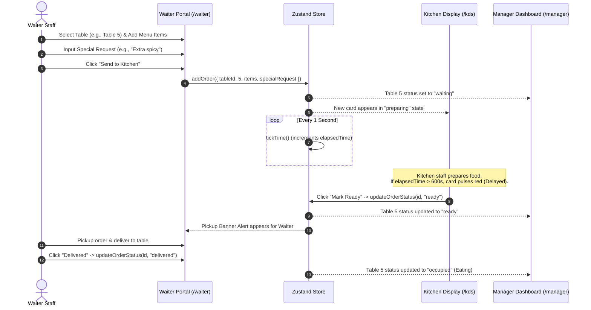

# NAAR Management System - Comprehensive Codebase Analysis & Architecture Report

## 1. Executive Summary & Project Purpose

**NAAR Management System** is a real-time, web-based prototype application engineered for fine-dining restaurant operations (specifically tailored for South Asian / Pakistani cuisine venues featuring items such as Biryani, Karahi, Seekh, Samosa, Chai, and Lassi). 

The primary objective of the system is to streamline communication between **Front-of-House (Waiters)**, **Back-of-House (Kitchen Staff)**, and **Management (Floor Managers)** through a synchronized, role-specific digital interface.

The application eliminates paper ticket delays, reduces order turnaround time, provides visual delay alerts for back-of-house staff, and equips managers with live table occupancy heat maps and key performance metrics (KPIs).

---

## 2. Tech Stack & Dependencies

The project is built on a modern React/Next.js ecosystem optimized for speed, developer ergonomics, and fluid UI responsiveness.

| Category | Technology | Version / Details | Purpose |
| :--- | :--- | :--- | :--- |
| **Framework** | Next.js | `14.2.15` (App Router) | Full-stack React framework providing routing and page rendering |
| **UI Library** | React | `^18.0.0` | Core UI engine |
| **State Management** | Zustand | `^4.5.5` | Centralized, reactive client-side global state store |
| **Styling** | Tailwind CSS | `^3.4.1` | Utility-first styling engine with customized dark/light themes |
| **Class Utilities** | `clsx` & `tailwind-merge` | `^2.1.1` / `^2.5.2` | Safe dynamic Tailwind class string composition |
| **Icons** | Lucide React | `^0.428.0` | Consistent, accessible iconography |
| **Date Helpers** | `date-fns` | `^3.6.0` | Time utility functions |
| **Language** | TypeScript | `^5.0.0` | Strict type safety for data models and state interfaces |

---

## 3. Directory & File Structure

```
NAAR Management System/
├── package.json               # Package manifests and script definitions
├── tsconfig.json              # TypeScript compilation setup
├── next.config.js             # Next.js configuration
├── tailwind.config.ts         # Tailwind CSS configuration
├── postcss.config.js          # PostCSS configuration
├── docs/                      # Architectural & technical documentation
│   └── codebase_analysis_report.md
└── src/
    ├── app/
    │   ├── globals.css        # Global CSS rules & CSS custom properties
    │   ├── layout.tsx         # Root layout embedding GlobalTimer & basic metadata
    │   ├── page.tsx           # Main Landing / Role Selector & Simulation Switcher
    │   ├── kds/
    │   │   └── page.tsx       # Kitchen Display System (KDS) View
    │   ├── waiter/
    │   │   └── page.tsx       # Waiter Mobile Order Entry Portal
    │   └── manager/
    │       └── page.tsx       # Manager Dashboard & Live Table Heat Map
    ├── components/
    │   └── GlobalTimer.tsx    # Unmounted background hook for tick intervals & order simulation
    └── store/
        └── useRestaurantStore.ts # Central Zustand state store, initial states, & mutations
```

---

## 4. Data Architecture & State Management

The core state of the application resides entirely inside a Zustand store defined in `src/store/useRestaurantStore.ts`.

### 4.1 Data Models

#### Order Status & Table Status Types
```typescript
export type OrderStatus = "preparing" | "ready" | "delivered";
export type TableStatus = "available" | "occupied" | "waiting" | "ready" | "clearing";
```

#### Order Item Entity
```typescript
export interface OrderItem {
  id: string;
  name: string;
  quantity: number;
}
```

#### Order Entity
```typescript
export interface Order {
  id: string;
  tableId: number;
  items: OrderItem[];
  status: OrderStatus;
  specialRequest?: string;
  timestamp: number;     // Date.now() when order was submitted
  elapsedTime: number;   // Elapsed seconds since submission
}
```

#### Table Entity
```typescript
export interface Table {
  id: number;
  number: number;
  status: TableStatus;
  currentOrderId?: string;
  occupancyTime: number; // Elapsed occupancy seconds
}
```

### 4.2 State Store Actions (`useRestaurantStore`)

- `addOrder(orderData)`: Generates a unique order ID, assigns `timestamp`, adds order to `orders` array, and marks corresponding table status as `"waiting"`.
- `updateOrderStatus(orderId, status)`: Updates order status to `"ready"` or `"delivered"`. Cascades status changes to table status:
  - Setting order status to `"ready"` -> updates table to `"ready"`.
  - Setting order status to `"delivered"` -> updates table to `"occupied"`.
- `updateTableStatus(tableId, status)`: Manually sets table status (e.g., clearing).
- `setDemoMode(active)`: Toggles live order simulation ON/OFF.
- `simulateOrder()`: Selects a random available table and a random menu item to generate a synthetic order automatically.
- `initializeDemoData()`: Pre-loads sample orders (with varying elapsed times, including delayed orders > 10m) and populates initial table states.
- `tickTime()`: Evaluates every second to increment `elapsedTime` for non-delivered orders and `occupancyTime` for active tables.

---

## 5. End-to-End Operational Workflow

The diagram below illustrates the life cycle of an order as it flows through the NAAR Management System roles:



---

## 6. Functional Module Analysis

### 6.1 Landing Page & Navigation (`src/app/page.tsx`)
- High-contrast, dark-mode landing interface centered around brand typography ("NAAR").
- Displays three large interactive action cards pointing to `/kds`, `/waiter`, and `/manager`.
- Contains the **Demo Mode Controller**: Initiates `initializeDemoData()` and enables recurring background order generation.

### 6.2 Kitchen Display System (`src/app/kds/page.tsx`)
- **Visual Design**: Dark theme (`bg-neutral-950`) designed for kitchen monitors and ambient glare reduction.
- **Card Sorting**: Displays active (non-delivered) orders sorted by longest elapsed preparation time (`b.elapsedTime - a.elapsedTime`).
- **Delay Warning Logic**: Orders exceeding 600 seconds (10 minutes) trigger a pulsing red border (`border-red-500 bg-red-950/40`) and highlighted timer text to alert chefs of delayed dishes.
- **Interactivity**: Includes a single-click "Mark Ready" button per ticket.

### 6.3 Waiter Entry System (`src/app/waiter/page.tsx`)
- **Visual Design**: Light theme (`bg-neutral-100`) optimized for handheld mobile screens under dining room lighting.
- **Order Creation**:
  - Dropdown selector for 20 tables.
  - Quick-tap color-coded menu grid (Biryani, Karahi, Seekh, Samosa, Chai, Lassi).
  - Quantity controls (`+` / `-`) and special request input field.
- **Pickup Notifications**: Live sticky alert banner that alerts waiters when any order transitions to `"ready"`, providing a one-tap "Delivered" button.

### 6.4 Manager Dashboard (`src/app/manager/page.tsx`)
- **KPI Metrics Header**:
  1. *Total Orders*: Count of all orders placed in session.
  2. *Queue (Preparing)*: Active orders currently being cooked.
  3. *Ready for Pickup*: Orders waiting on floor staff.
  4. *Avg. Wait Time*: Dynamic average preparation duration across all orders.
- **Live Table Heat Map**: 20-table responsive grid displaying table numbers, occupancy status badges, and elapsed occupancy timers.
  - `Available` -> Green
  - `Eating` -> Blue
  - `Waiting Food` -> Yellow
  - `Ready` -> Orange
  - `Clearing` -> Red

### 6.5 Simulation Engine (`src/components/GlobalTimer.tsx`)
- Renderless React component mounted at root (`RootLayout`).
- Manages two background timers via `setInterval`:
  - `1000ms` interval: Executes `tickTime()` for real-time timer calculations across all pages.
  - `15000ms` interval (active when `demoMode === true`): Automatically calls `simulateOrder()` to randomly assign orders to available tables.

---

## 7. Recommendations & Future Technical Roadmap

While the existing prototype effectively demonstrates real-time restaurant orchestration, scaling to production deployment requires addressing the following key architectural areas:

### 1. Multi-Device Real-Time Sync (Backend Integration)
- **Current State**: State is localized to the single browser client session.
- **Recommendation**: Integrate a WebSocket server (Socket.io) or Server-Sent Events (SSE) backed by PostgreSQL/Supabase. This will synchronize order state seamlessly across separate physical devices (e.g., kitchen iPad, waiter phones, manager PC).

### 2. Multi-Tenant & Database Persistence
- **Current State**: In-memory state lost upon full page reload (unless Demo Mode re-initializes static data).
- **Recommendation**: Implement persistent database schema with Prisma ORM or Drizzle ORM to record historical sales analytics, table turnover rates, and item popularity.

### 3. Financial & Point-of-Sale (POS) Features
- **Current State**: Menu items lack individual prices and receipt calculation logic.
- **Recommendation**: Add `price` fields to `OrderItem`, support tax calculation, discount processing, split bills, and integration with payment gateways (Stripe / local terminal APIs).

### 4. Table Clearing & Turnaround Lifecycle
- **Current State**: Table transitions from `"waiting"` -> `"ready"` -> `"occupied"`.
- **Recommendation**: Add explicit table clearing actions ("Mark Cleared") so busboys/waiters can cycle tables back from `"clearing"` to `"available"`.
